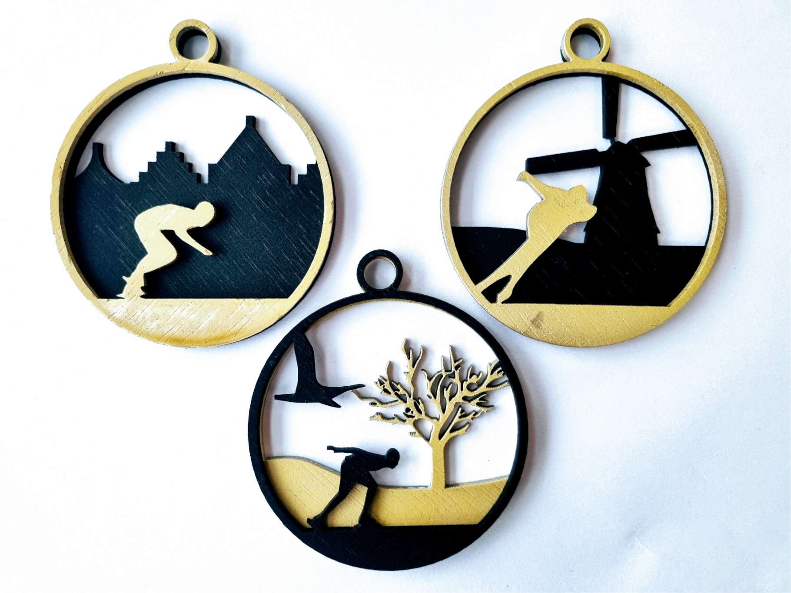
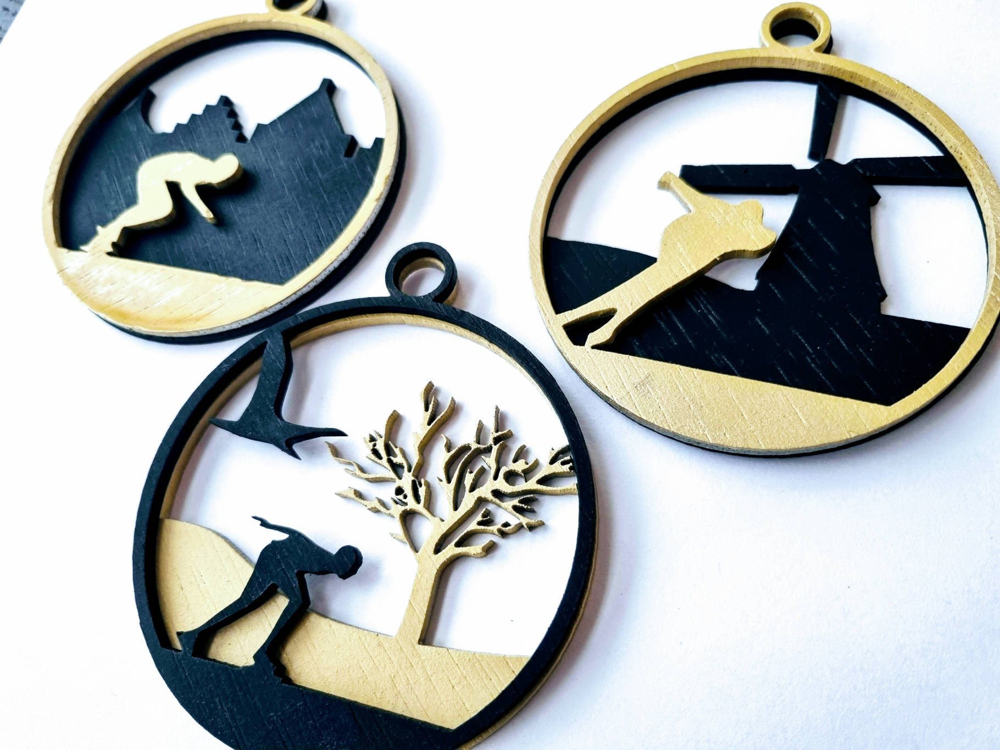

# Dutch Ice Skater Collection
Pendants with scene's of a Dutch ice skater.

Each `SVG` file contains multiple parts consisting of red and blue lines. These are the lines meant to be cut.  

# Results

# Links
- [Inkscape](https://inkscape.org/) for designing the SVG files.
- [LaserSaur](https://www.lasersaur.com/) for laser cutting.
- [Pinterest](https://nl.pinterest.com/muaddev/dutch-winter-scene/) inspiration board.

# Tips
- The `template.svg` file can be used for a quick start.
- The `parts` directory contains the individual SVG object files used in each scene.
- The `results` directory contains examples of a finished product. 
- When a layer has been designed use the boolean operations in Inkscape to cut with the round circels from the `template.svg` to make the scene fit inside the pendant. 
- Each file already contains the Lasersaur settings used in the `text` sections as lasertags, see [here](https://github-wiki-see.page/m/nortd/lasersaur/wiki/lasertags).
- When painting, start with the back so that when that has dried you can immediately turn it over and paint the front and leave that drying longer.

# Review
- Using spray paint to color the pendants did not give as nice results as expected. Using a different method is recommended.